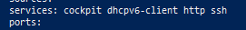

# AWS Project: Secure RHEL 9 Web Server

##  Project Overview

Designed and deployed a secure, high-availability web server using **Red Hat Enterprise Linux 9 (RHEL 9)** on Amazon Web Services (AWS). This project simulates a real-world enterprise environment where standard Amazon Linux images are insufficient, requiring manual configuration of OS-level security controls.

##  Technical Architecture

*   **Cloud Provider:** AWS (EC2)
*   **Operating System:** Red Hat Enterprise Linux 9 (RHEL 9)
*   **Web Server:** Apache HTTP Server (httpd)
*   **Security Layer 1 (Cloud):** AWS Security Groups (Port 80/22)
*   **Security Layer 2 (OS):** Linux Firewalld (Service management)

## Proof of Implementation

### 1. The Live Web Server
*Verified public access via AWS Public IP, demonstrating successful web server configuration and DNS routing.*


### 2. Security Configuration
*Verified internal firewall rules using `firewall-cmd`. This demonstrates that the http service was specifically allowed through the OS kernel firewall.*



##  Challenges & Solutions

**Challenge 1: The "Missing Firewall" Issue**

*   **Issue:** Upon attempting to configure the internal firewall, the system returned `command not found` for `firewall-cmd`.
*   **Diagnosis:** The RHEL 9 Minimal AMI on AWS does not come with `firewalld` installed by default to save resources.
*   **Solution:** Manually installed the firewall package (`dnf install firewalld`), enabled the service via `systemctl`, and then configured the rules.

**Challenge 2: Connection Timeout**

*   **Issue:** Even after starting Apache, the site would not load in the browser.
*   **Diagnosis:** Troubleshooting revealed that while the OS firewall was open, the AWS Security Group (Cloud Firewall) was only allowing Port 22 (SSH).
*   **Solution:** Updated the AWS Security Group Inbound Rules to allow TCP Port 80 from `0.0.0.0/0`.

##  Key Commands Used

```bash
# 1. Elevate to Root
sudo -i

# 2. System Update & Install
dnf update -y
dnf install httpd firewalld -y

# 3. Enable Services
systemctl enable --now httpd
systemctl enable --now firewalld

# 4. Configure Internal Firewall
firewall-cmd --permanent --add-service=http
firewall-cmd --reload

# 5. Create Content
echo '<h1>Hello Kansas City!</h1>' > /var/www/html/index.html
